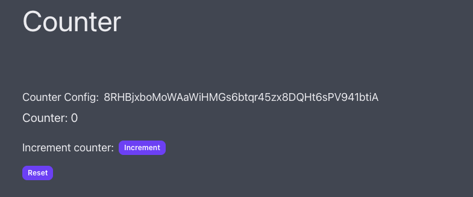

# Dapp-starter

This repo provides a starting point for building a dapp on the `renec` blockchain.

# Overview

  - [Project Structure](#project-structure)
  - [Prerequiresites](#prerequisite)
  - [Dependencies](#dependencies)
     - [Installation](#installation)
     - [Setup wallet](#setup-wallets)
  - [How to use ?](#how-to-use-)
     - [Rpc Endpoint](#rpc-endpoint)
     - [Build & Deploy](#build--deploy)
     - [FE & Dapp](#frontend)
  - [Port Dapp from Solana](#port-dapp-from-solana)
  - [Notes](#frontend)
# Project Structure

- `programs`: This folder contains the logic code for the program. It uses `anchor` framework to build the program.
- `app`: This folder contains FE code for the dapp. It uses `next-js` and `typescript` to build the FE.
- `dev-scripts`: This folder contains scripts to build and deploy the program, and to setup the FE using `bash-scripts`. Support running on `Unix` environemnt.
- `tests`: This folder contains tests for the `program`

# Prerequisite

- For Linux user:

```bash
 sudo apt-get update && sudo apt-get upgrade && sudo apt-get install -y pkg-config build-essential libudev-dev
 sudo apt install libssl-dev
```

- For Mac user:

```bash
brew install openssl
```

- For Window user
  - TODO
# Dependencies
  
  ## Installation
- To setup program dependencies, run:

```bash
make install-deps
```

This will install the `anchor` and `solana` cli if needed. Default `solana 1.14.6`, `anchor 0.25.0`

To use different version compatible with `renec cluster`, set the `CLUSTER` and `ANCHOR_VERSION` environment variables and run the command
</br>
For example:

```bash
CLUSTER=mainnet ANCHOR_VERSION=0.20.1 make install-deps
```

`CLUSTER` can either be `mainnet`, `testnet` or `localnet`. By setting the cluster correctly, the installer will set the corresponding `cli` for program's interaction.

- To run a `localnet` that has the same version as `renec-mainnet`, run;

```
make localnet
```

- To run a `localnet` that has the same version as `renec-testnet`, run;

```bash
CLUSTER=testnet make localnet
```

`CLUSTER` variables can be either `mainnet`, `testnet` or `localnet`, which corresponding to `RENEC cluster url`. Default `CLUSTER` is `testnet`.

  ## Setup wallets

- To gen a new wallet, run:

```bash
make gen-wallet name="<wallet-name>"
```

If not passing `name` parameter, the default name of the wallet will be `id`. The wallets' screte keys will be stored in `./wallets` folder.

- To import an existing wallet, run:

```bash
make import-wallet name="<wallet-name>"
```

- To request faucet token in `testnet` or `localnet`, run:

```bash
make faucet amount=1  name="<wallet-name>"
```

# How to use ?

## Rpc Endpoint
  - Several providers offer free RPC access to the public Renec clusters. These services are good for real-world testing, early demos, and small, private beta programs. Keep in mind that you get exactly what you are paying for. Free RPC typically do not autoscale, are rate-limited, offer no SLA, and are not afraid to ban abusers. When an application is ready to be opened to the public, it is time to invest in private RPC access.
  - Some free RPC providers:
    - Mainnet
        - https://api-mainnet-beta.renec.foundation:8899/
    - Testnet
        - https://api-testnet.renec.foundation:8899/
## Build & Deploy

- Build program:
```bash
make build
```

Notes:

  - This command will generate the `program keypair` if needed, and replace it inside `programs/dapp-starter/src/lib.rs` file.
    Then it will build the program and generate `program so` file.

  - For FE interaction, this script copies the `dapp_starter.json`, `dapp_starter.ts` and replace `program_id` into the `config.json` file in `app/src/artifacts` folder.

- Deploy program:
```bash
CLUSTER=mainnet make deploy name="<wallet-name>"
```
Notes:

  This command deploy the program, under `.wallets/<wallet-name>.json` authority. The program will be deploy to `CLUSTER` env, which could either be `localnet`, `mainnet` or `testnet`

## Frontend

- The frontend is built with `next-js` and `typescript`. It uses `@project-serum/anchor` to interact with the program.
  </br>

- The FE uses [daemon-wallet](https://renec.foundation/en/support/how-to-create-a-new-demon-wallet) to connect with `renec-blockchain`.
  

- The provided program and the FE provide a simple `counter` program, which allows users to `initialize a counter`, and `increment` the count in that `counter`.
  

### Presequisites

- [Node.js 16.8.0](https://nodejs.org/en) or newer
- `build and deploy` the program to the `renec testnet`. Make sure that you've run `make build` and `CLUSTER=testnet make deploy` before running the frontend.

### Build and run

```bash
cd app
```

```bash
yarn && yarn dev
```

# Port Dapp from Solana
  - TODO
# Notes
